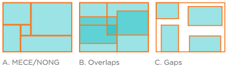
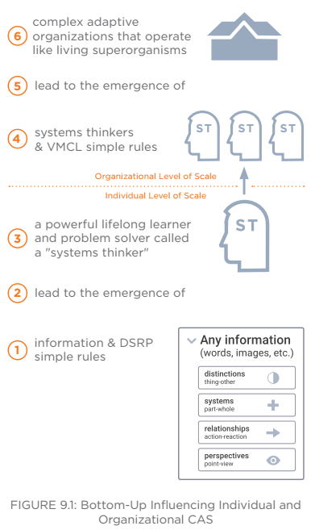
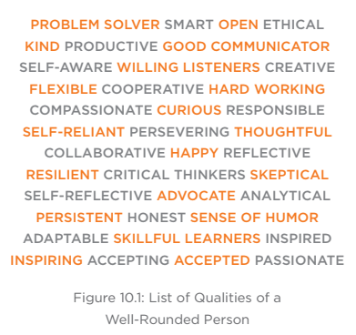
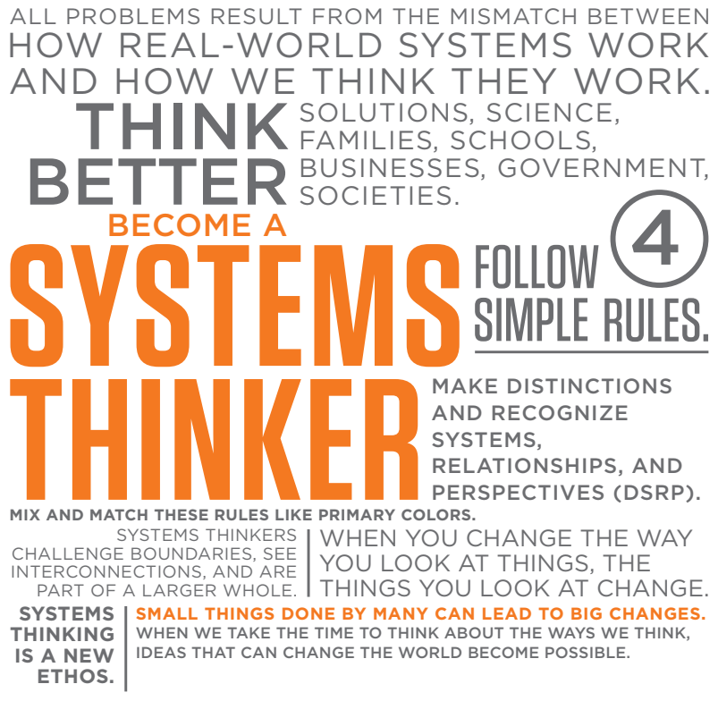

# Systems Thinking Made Simple
New hope for Solving Wicked Problems, 2nd ed
By Derek Cabrera & Laura Cabrera

## Section 1 Simple Rules of Systems Thinking

### 1 New Hope for Wicked Problems

\[Google: Peter Senge's _The Fifth Discipline_\]

Wicked Problems involve
* many interlinked issues, cutting across the usual silos -> high degree of complexity
* multiple agencies (across the public, private and voluntary sectors) trying to account for multiple scales (local, regional, national and global)
* many different views on the problem and potential solutions
* conflict over desired outcomes or the means to achieve them, and power relations making change difficult
* uncertainty about the possible effects of action

Democratizing systems thinking... To save our planet, solve crises, understand complex systems and their wicked problems, we don't just need better scientists who think more systemically, we need better _citizens_ who think systemically.

Translational research is the study of how to translate into practice abstract theories that can be used to better the real world

### 2 The Simplicity that Drives Complexity

Systems Thinking v1.0... MFS Universe of Systems Thinking -- MFS = Midgley, Francois, and Schwartz
* Formal theories such as network theory, chaos theory, or general systems theory
* Important concepts such as unintended consequences
* Approaches designed for specific purposes such as soft systems methodology (group process)
* Modeling methods for building models of systems such as system dynamics

[Figure 2.2](images/stms-mfs-universe-elements.png) shows the select elements of the MFS Universe of Systems Thinking

Systems Thinking v2.0 prerequisites to understanding
* idea of mental models and the constant role they play in our everyday lives
* better understand concept of a complex adaptive system (CAS)

Whenever we don't get the results we want, whenever the behavior of a system surprises us, whenever the treatment doesn't solve the problem, it's the real world giving us feedback that there's something wrong with our mental models.

The original intent of systems thinking was to get better at understanding the real world by coming up with new and improved mental models of the real world

**Getting Reality Right**

"All \[mental\] models are wrong; the practical question is how wrong do they have to be to not be useful." —George E.P. Box, British mathematician

Nobel laureate Herbert Simon coined the term _satisficing_ and contrasted it with optimizing... okay with good enough because it gets the job done.

In his book, _Thinking, Fast and Slow_, Nobel laureate and psychologist Daniel Kahneman describes his research on two modes of thought he calls System 1 and System 2[^systems-1-and-2]... System 1 is evolutionarily valuable because although it's often wrong, it's right enough (i.e., cognitive satisficing) and has the added advantage of being fast.

What we need is System 2 accuracy with the speed of System 1.

"An organization's ability to learn, and translate that learning into action rapidly, is the ultimate competitive advantage." —Jack Welch, CEO

The process of system thinking results in a product: mental models... So systems thinking must be a form of thinking that is somehow qualitatively better at helping us build our mental models. Otherwise, it's just plain old thinking, with all its sundry biases and issues.

**Complex Adaptive Systems (CAS)**

Examples of complex things that have relatively simple rules underneath
* Rainbow of colors: CYMK—Cyan, Magenta, Yellow, and Black[^cmyk] \[google why not cmyb\]
* Biodiversity: ATCG—Adenine, Thymine, Cytosine, Guanine
* Learning Karate: Wax on, Wax off \[But maybe only in _The Karate Kid_. I took Karate for PE class but just for one semester, we didn't wax or paint or spar to the tune of _Glory of Love_.\]
* Infinite builds: Modular Lego Bricks[^lego]
* Chess: Pieces and moves

\[These examples lead up to Systems Thinking: DSRP\]

### 3 Four Simple Rules of Systems Thinking

**DSRP**
* Distinctions rule: Any idea or thing can be distinguished from the other ideas or things it is with.
* Systems rule:      Any idea or thing can be split into parts or lumped into a whole.
* Relationship rule: Any idea or thing can relate to other things or ideas.
* Perspectives rule: Any thing or idea can be the point or the view of a perspective.

#### Distinctions rule

Distinctions are boundaries, not things

What is important is that our distinctions are actually distinct. This may seem obvious, but it is frequently not the case.

\[Reminds me of a team meeting where our lead mentioned the state of a user story being "Done Done Done." And then in a separate meeting I had with a teammate, I mentioned "Done done" and only using 2 dones to differentiate from the 3 dones. Reminds me of another thing--we used to refer to one of the environments as "PROD-PROD". ``¯\_(ツ)_/¯``\]

There are two ways that distinctions end up not being very distinct:
1. We use the same words to describe things or ideas that are different; and
2. We use different words to describe things or ideas that are actually the same

MECE (or NONG)
* MECE: Mutually Exclusive and Collectively Exhaustive
* NONG: No Overlaps, No Gaps

#### Systems rule

#### Relationships rule

#### Perspectives rule

## Section 2 Becoming A Systems Thinker

### 4 See Information and Structure

Learning to visually map systems thinking will allow you to:
1. Gain deeper understanding of systems thinking and the systems you're thinking about; and
2. Visually capture mental models and communicate to others.

\[Getting Miro was one of the best investments (although of course I wish I had been reimbursed for it, because I used it for work after all). It made my ideas or understanding of the requirements easier to discuss with teammates and stakeholders.\]

Systems thinking in comparison to language:
* text = _information_
* grammar and syntax = _structure_

Structure includes the hidden contextual structure that contributes to meaning \[the I love to eat Grandma example of how a comma makes a difference... but my fave is one from experience. See how the comma is important here: Let's eat, guys!\]

Developing a more universal visual grammar will increase understanding and aid communication
1. use the same shapes for all distinctions;
2. use lines exclusively for relationships; and
3. use containment (not lines) exclusively for part-whole

### 5 Use and Reuse Cognitive Jigs

A cognitive jig is a common underlying structure of systemic thought. `wut` \[I didn't get anything from that.\]

Cognitive jigs you've used countless times before--perhaps without being aware of it:
* analogies
* metaphors
* similes  
* categories

Jigs go by other names: stencils, patterns, templates, overlay, boilerplate, and guides. Primary purpose is to provide replicability and accuracy in the creation of products.

New cognitive jigs \[are these tool specific?\]
* P-circles or Perspective Circles - \[just seem like dot-indicators in the graph, wherein the dot color indicates the perspective it's being viewed from\]
* Part-Parties - So the basic idea of a Part-Party is (1) break down a thing or idea into parts and (2) relate the parts
* Barbells - two ideas or things and the relationship between them
* R-Channels or Relationship-Channels - subtype of RDS Barbells

Simple Barbells can be evolved to become RDS Barbells
* R - Relate - make a relationship --> draw a line
* D - Distinguish - identify what the relationship is --> add a square and label to the line
* S - Systematize - recognize the distinct relationship as a system by identifying its parts --> add smaller squares

### 6 Make Structural Predictions

Far transfer means that when you learn something in one domain, you can transfer it to another domain and use it there... what's transferring is not content, but structure.
\[example was kids were taught about part and wholes in context of firetruck... and they extended it to apple and lockdown\]

\[example wasn't very clear. the reference figure 6.16 was conveniently easily mapped to 6.17. They mention DSRP predicts both the gaps we need to fill in our knowledge, and where best to spend our efforts to gain a deeper understanding and solution. But looking at 6.20, I don't think it clearly illustrates that predictive capability. It was just a visualization of 6.16.\]

### 7 Embrace And/Both Logic

Bi-valent logic vs Multi-valent logic --> But DSRP goes for and/both. DSRP logic can be bivalent and multivalent.

Aristotle was of course Plato's best student \[why of course?\] and Plato was a student of Socrates. Socrates developed the Socratic Method... \[why bring up Aristotle and Plato even?\]

\[Used Socratic questioning to build up to...\] "MadLib" style DSRP questions

### 8 Everyday and Advanced Applications of DSRP

DSRP provides a fundamental theory of systems thinking. With it, everything in systems thinking makes sense. `wut` \[hmmm show don't tell\]

DSRP rules offer:
* A common language, grammar, and structure for all systems thinking and systems sciences;
* Insight into where various specialized methods can improve and where they stand out;
* Co-evolving generalization and specialization functions in the field, which increase adaptation, cross-pollination, robustness, and diversity, while decreasing silo-fication and tribalism;
* Accessibility, which increases the field's hospitality to newcomers and therefore its adoption rate...; and
* A new and definitive systems logic for developing new methods and approaching wicked problems

#### Everyday Tools

\[enumeration of modeling / visualization tools ?\]
* XY graphs
* Tables
* Brainstorming of "Splat maps"
* Process maps
* Ishikawa or fishbone diagrams
* Novakian concept maps -- \[new term\] -- relationships are identified with words or phrases
* Hierarchical trees e.g., Mind Map

Despite meta-analysis research that indicates that brainstorming doesn't work \[gotta lookup the citation for this one\][^brainstorming]

When written works lack a coherent thread, it's because writers are putting a bunch of ideas into a part-whole structure but failing to think about the relationships that link them all together.. \[so meta\]

#### Formal Systems Thinking Methods

**System dynamics**... The basic idea behind system dynamics is a particular type of relationship called feedback.
Feedback can be positive or negative, and there are two kinds of feedback loops: balancing and reinforcing.
We can think of these accumulations as a "stock" and the rates as "flows" \[but stock != accumulation right?\]

**Soft systems methodology (SSM)** - seven-step process
1. entering the problem situation
2. expressing the problem situation - CATWOE mnemonic
3. formulating root definitions of relevant systems
4. building conceptual models of human activity systems
5. comparing the models with the real world
6. defining changes that are desirable and feasible
7. taking action to improve the real world situation

CATWOE = Clients, Actors, Transformation, Weltanschauung (worldview), Owner, Environmental constraints

**Network theory**... networks consist of nodes and edges \[but doesn't distinguish the nodes and edges... so maybe just google network theory\]

## Section 3 7 Billion Systems Thinkers

### 9 Scaling Systems Thinking

If for self or another person - develop your and their practice of DSRP

If you want to pursue a role as a systems leader and apply systems thinking for your organization
* first, understand the role systems thinkers play as agents in the organization
* second, learn for additional simple rules: VCML = vision, mission, culture and learning

**Circle of Influence vs Circle of Concern**
* The most effective people are those who are proactive rather than reactive.
* Proactive people focus where they have influence (for most of us is a smaller circle than our circle of concern.)
* In contrast, a reactive approach focuses on concerns, which in turn detracts from our influence.

### 10 Systems Thinkers Wanted

Dichotomy of types of thinkers
* Apollonians tend to favor logic, rationality and analysis
* Dionysians go in more for intuition, feeling, and synthesis
* Odysseans, in the middle, strive for the union of both styles

Dichotomy of systems thinkers
* holists and reductionists
* left-brained (logical) and right-brained (creative)
* hard (logic and analytics) and soft (creativity and intuition) skills
* heart and mind

The truth is that no matter which terms we use to describe the two sides, the dichotomy is false. `wut`
\[I think it may have been more effective for me if the structure was: (a) raise that there's a dichotomy that we need to look beyond, then (b) share the dichotomies.  Vs (a) talking about all these dichotomies, and then (b) saying it doesn't matter because the dichotomy is false.\]

The kinds of adults we want...
* Critical thinkers who can analyze and solve problems;
* Creative thinkers who can see new and innovative solutions to problems;
* Scientific thinkers who can recognize biases, seek new knowledge, and investigate complex phenomena;
* Prosocial thinkers who can work well with others and build strong communities; and
* Emotionally intelligent individuals who possess a sense of themselves and what they offer to the world.

`#sanaol`

Can the simple DSRP rules of systems thinking help us to develop emotional intelligence, prosocial skills, compassion, empathy, introspection, perseverance and grit, and an internal ethical compass? The answer is yes and the key is an idea called _metacognition_.

#### Metacognitive Awareness

The scientific term for thinking is cognition. The scientific term for thinking about one's thinking is metacognition.

The following are all acts of metacognition:
* Awareness that everything you experience is a mental model that approximates the real world;
* Awareness of the distinctions you make and the emotions and motivations that may have influenced you to make them;
* Awareness that everything you and others think is being influenced by one or more perspectives;
* Awareness that there are many ways to organize and interrelate ideas and things (and your current way is just one of them); and
* The ability to distinguish among cognition (thinking), emotion (feelings), and conation (motivations) and the awareness of how these different human capacities influence our mental models and behavior.

The development of self-awareness exists on a continuum...
Unconscious Incompetence --> Conscious Incompetence --> Unconscious Competence --> Conscious Competence

### 11 CAS Organizations: Systems Leaders Wanted

**VMCL**
* Vision:   a concise future state or goal;
* Mission:  simple repeatable rules that lead to the vision;
* Capacity: a system of systems that are laser-focused on doing the mission; and
* Learning: incremental improvements to capacity, mission, and vision based on better shared mental models

In complex systems like human organizations, the way the system behaves is emergent (a product of varied actions by autonomous agents), which means that the results you want are emergent. `wut`

A superorganism is a bunch of independent organisms acting in unison. That is precisely what every CEO and president wants their organizations to be, even if they don't know it yet.
... they \[superorganisms\] have a knack for taking a bunch of self-interested, autonomous agents (say employees) and transforming them into much more than a well-oiled machine... and without the often slow and blunt instrument of leadership. \[but title of chapter is systems leader wanted\]

If you want a superorganism, your maxim should be to distrust what is complicated and trust simplicity. Simplicity will get you complexity, and complexity is what you want because complexity drives adaptation, robustness, and intelligence. `wut`

Culture is the process of a group of people learning in such a way as to share important mental models. So culture is actually caused when individuals in an organization begin to share the same mental models.

Learning, capacity, mission, and vision are a function of culture. So the single thing that will bring these three things about is _culture_. `wut` \[isn't there four things?\]  Therefore, you need to do just one thing: _build a culture of systems thinkers who drive organizational learning to improve organizational capacity to do your mission repeatedly and bring about your vision._

To create culture, repeatedly build and share mental models among all of your agents. \[idk, people don't really go around saying "Hey, I've got this mental model I'd like to share with you..."\]

### 12 Conclusion and Systems Thinking Manifesto

---

[^systems-1-and-2]: "System 1 operates automatically and quickly, with little or no effort and no sense of voluntary control. System 2 allocates attention to the effortful mental activities that demand it, including complex computations." —From _Thinking, Fast and Slow_ by Daniel Kahneman

[^lego]: Ole Kirk Christiansen, a carpenter, founded Lego in 1932. At the time, he was out of work because of the Depression and decided to build wooden toys in Denmark.

[^brainstorming]: Mullen, B., Johnson, C., & Salas, E. (n.d.). Productivity Loss in Brainstorming Groups: A Meta-Analytic Integration. _Basic and Applied Social Psychology, 3-23_.

## Meta

USD 23.99 for the Kindle version. Couldn't access this on my Kindle or on the [web version](https://read.amazon.com/). Had to download the Kindle app on my laptop to read this. Thank goodness, it's somewhat free (covered by Kindle Unlimited membership).

It keeps marketing Plectica, a diagramming tool.
